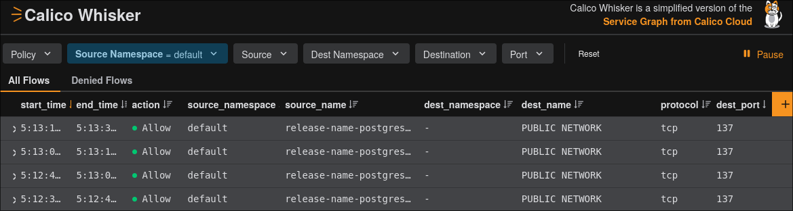

* Demo workflow
** Intro part

We welcome the player and ask him whether he/she is good and
Kubernetes troubleshooting. We tell them that there is a simple
Kubernetes cluster that runs a Postgresql database that contains user
credentials.

We received reports recently that the credentials may have been
leaked. More and more users are complaining about "hacked" accounts.

Your task is to verify the system from security perspective.

** Troubleshooting part

We give the user a laptop, with =kubectl= and =k9s= installed. They
have admin access. They will probably check the pods, the logs, but
there is nothing suspicious.

We give them the following hints:

1. No one can access the database except for us.
2. The system is highly secured. An external firewall is in
   place. Nobody can access the database from the outside.
3. We have recently reinstalled the host operating system. There can
   be no virus there.
4. Before the incident, we performed a Postgresql version upgrade.

The user will unable to find the security issue.

** Whisker part

We will present the user the Whisker dashboard. The user will play
with it. With our help, they will find a suspicious outgoing
connection:

** NetworkPolicy part

If the player is interested, we can help them to provision a network
policy that prevents the communication to the public internet.

This section demonstrates Calico's tiered policy model introduced in
v3.32 with =ClusterNetworkPolicy=.

*** Step 1: Stage a deny policy (dry-run)

Apply a *staged* =ClusterNetworkPolicy= that would deny all egress
from the postgres database to the public internet. Because it is
staged, it does /not/ take effect yet — but Whisker shows what it
/would/ block.

#+begin_src bash :results output
kubectl apply -f staged-cnp.yaml
#+end_src

Switch to Whisker and use the new **staged-actions filter** to see
which flows this policy would deny. The suspicious outgoing connection
to =3.14.137.65= should appear as a "pending deny."

*** Step 2: Enforce the policy

Once we are confident the policy does what we expect, replace the
staged policy with the real =ClusterNetworkPolicy=:

#+begin_src bash :results output
kubectl delete -f staged-cnp.yaml
kubectl apply -f cluster-networkpolicy.yaml
#+end_src

The data exfiltration is now blocked. Whisker shows the connection as
=Denied=.

*** Why ClusterNetworkPolicy matters

A regular Kubernetes =NetworkPolicy= is namespace-scoped: any
developer with access to the namespace can create, modify, or delete
it. A =ClusterNetworkPolicy= in the =Admin= tier (order 1000) is
/enforced above/ all namespace-scoped policies — developers /cannot/
override it. This is the key security differentiation of Calico's
tiered policy model.

* Preparations

These preparations help to give a demo in an unreliable-network
environment.

** Firewall

Disable the firewall on the host.

** Dummy network interface

Create a dummy network interface with the name =whisker=.

#+begin_src bash :eval never
sudo ip link add dev whisker type dummy
sudo ip addr add 3.14.137.65/28 dev whisker
#+end_src

** Postgres image
*** Building the image

You can build the image with the following command.

#+begin_src bash :results output
docker build 2026/postgresql/ -t postgresql/postgresql:16
#+end_src

*** Save the image

Save the image.

#+begin_src bash :results output
docker save postgresql/postgresql:16 -o postgres_16.tar
#+end_src

#+RESULTS:

** Postgres manifest files

You can generate the Postgres deployment manifest with the following
command.

#+begin_src bash :results output :dir 2026/postgresql/hack
helm template postgres \
  --repo https://groundhog2k.github.io/helm-charts \
  --namespace postgres \
  --create-namespace \
  -f postgres-values.yaml \
  --version 1.6.3 | \
  sed '/^metadata:/{n;s/^  name:/  namespace: postgres\n  name:/}' > postgres.yaml
#+end_src

Note: =helm template= does not inject =namespace:= into the rendered
output. The =sed= pipe above adds =namespace: postgres= after each
=metadata:= block so the resources land in the correct namespace.

** Calico resources
*** Manifest files

Download the Calico manifest files:

#+begin_src bash :results output
curl -LO https://raw.githubusercontent.com/projectcalico/calico/v3.32.0/manifests/operator-crds.yaml
curl -LO https://raw.githubusercontent.com/projectcalico/calico/v3.32.0/manifests/tigera-operator.yaml
curl -LO https://raw.githubusercontent.com/projectcalico/calico/v3.32.0/manifests/custom-resources.yaml
#+end_src

#+RESULTS:

Then update =custom-resources.yaml= so that the
=spec.calicoNetwork.ipPools.[0].cidr= field has the value
=192.168.101.0/24= in the =Installation= resource.

*** Container images

#+begin_src bash :results output
VERSION="v3.32.0"
IMAGES=("typha" "kube-controllers" "node" "csi")

for IMAGE in ${IMAGES[@]}
do
  echo "Saving ${IMAGE}:${VERSION}"
  docker pull "quay.io/calico/${IMAGE}:${VERSION}"
  docker save "quay.io/calico/${IMAGE}:${VERSION}" -o "${IMAGE}.tar"
done

VERSION="v1.42.0"
echo "Saving operator:${VERSION}"
docker pull "quay.io/tigera/operator:${VERSION}"
docker save "quay.io/tigera/operator:${VERSION}" -o operator.tar
#+end_src

* Create demo environment manually

** Start the netcat server

#+begin_src bash :eval never
sudo nc -kl 3.14.137.65 137 | pv > /dev/null
#+end_src

** Kind config file

#+begin_src yaml :tangle kind-config.yaml
kind: Cluster
apiVersion: kind.x-k8s.io/v1alpha4
nodes:
- role: control-plane
- role: worker
- role: worker
networking:
  disableDefaultCNI: true
  podSubnet: 192.168.101.0/24
#+end_src

** Create the kind cluster

#+begin_src bash :results output
kind create cluster --name whisker-the-game --config kind-config.yaml
#+end_src

#+RESULTS:

Then check the cluster state:
#+begin_src bash :results output
kubectl cluster-info
#+end_src

#+RESULTS:
: Kubernetes control plane is running at https://127.0.0.1:33839
: CoreDNS is running at https://127.0.0.1:33839/api/v1/namespaces/kube-system/services/kube-dns:dns/proxy
:
: To further debug and diagnose cluster problems, use 'kubectl cluster-info dump'.

** Upload the container images

#+begin_src bash :results output
IMAGES=("typha" "kube-controllers" "node" "csi" "operator" "postgres_16")

for IMAGE in ${IMAGES[@]}
do
  echo "Uploading ${IMAGE}"
  kind load image-archive "${IMAGE}.tar" \
       --name whisker-the-game           \
       --nodes whisker-the-game-control-plane,whisker-the-game-worker,whisker-the-game-worker2
done
#+end_src

#+RESULTS:
: Uploading typha
: Uploading kube-controllers
: Uploading node
: Uploading csi
: Uploading operator
: Uploading postgres_16

** Install Calico CRDs

#+begin_src bash :results output
kubectl apply -f operator-crds.yaml
#+end_src

** Install the Tigera Operator

#+begin_src bash :results output
kubectl apply -f tigera-operator.yaml
#+end_src

#+RESULTS:
: namespace/tigera-operator created
: serviceaccount/tigera-operator created
: clusterrole.rbac.authorization.k8s.io/tigera-operator-secrets created
: clusterrole.rbac.authorization.k8s.io/tigera-operator created
: clusterrolebinding.rbac.authorization.k8s.io/tigera-operator created
: rolebinding.rbac.authorization.k8s.io/tigera-operator-secrets created
: deployment.apps/tigera-operator created

** Install the Calico resources

#+begin_src bash :results output
kubectl create ns calico-system 2>/dev/null || true
kubectl apply -f custom-resources.yaml
#+end_src

#+RESULTS:
: apiserver.operator.tigera.io/default created
: goldmane.operator.tigera.io/default created
: whisker.operator.tigera.io/default created

** Install postgres YAML manifests

#+begin_src bash :results output :dir 2026/postgresql/hack
kubectl create ns postgres --dry-run=client -o yaml | kubectl apply -f -
kubectl apply -f postgres.yaml
#+end_src

#+RESULTS:
: namespace/postgres created
: secret/release-name-postgres created
: configmap/release-name-postgres-scripts created
: service/release-name-postgres created
: statefulset.apps/release-name-postgres created

** Stage the deny policy (dry-run)

Apply the staged =ClusterNetworkPolicy=. It will /not/ enforce yet,
but Whisker will show what it would block as "pending/staged" actions.

#+begin_src bash :results output
kubectl apply -f staged-cnp.yaml
#+end_src

** Enforce the deny policy

When ready, remove the staged policy and enforce the real
=ClusterNetworkPolicy=:

#+begin_src bash :results output
kubectl delete -f staged-cnp.yaml
kubectl apply -f networkpolicy.yaml
#+end_src
* Cleanup
** Delete kind cluster

#+begin_src bash :results output
kind delete cluster --name whisker-the-game
#+end_src

#+RESULTS:
